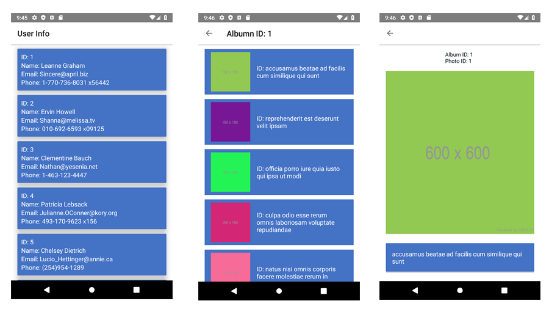

# SampleTestAndroidApp

An Android app that shows a list of Users and related photos. It's a sample coding challenge. (100% Kotlin)

This app has modified `gradle.properties` file which helps organize gradle much effectively.

## Screenshots



## Project Used:
* Android Studio 3.6.3
* Kotlin Version 1.3.72
* Gradle Build Version 3.5.3
* Android Version 10
* JVM 1.8

## Architecture

> MVI (MVVM + more...) + Architecture Components (ViewModel & Lifecycle-aware components) + Dagger2 + LiveData + Kotlin Coroutines + Retrofit

I used MVI architecture which is basically a MVVM with better state management and shared Viewmodels, StateEvent and ViewState.

MVI is short for Model-View-Intent. Here, Intent means the intention with which we're performing certain actions in our app; not [`Intent`](https://developer.android.com/reference/android/content/Intent), as in the Android object.

Abiding the Sigle Source of truth principle, Repository is designed accordingly which can easily be modified in future if we need to do caching in future. I've tried and experimented to generify as much classes as possible on this project, mainly, Network and Repository classes to handle DataState, StateEvent and ViewState effectively.

Use Cases are used to perform business logic operations on the data obtained from the repositories.

Unit tests are still a very painful topic for me to be honest. However I've tried to cover as much test cases as possible.

### Why MVI?

Great question!

MVVM (Model-View-ViewModel) is better and recommended design-pattern by google in the sense that it doesn't require you to have a View for each ViewModel, but there is the problem of state synchronization. It gets difficult and weird sometimes with ViewModel and it tends to be out of sync if the code isn't robust.

### So how does MVI solve this issue?

That's another fantastic question, you're on quite a roll! 

MVI solves the state synchronization issue by storing states as model classes, in the form of Kotlin sealed classes. Model as State: UI might have different states - Loading State, Data State, Error State etc. In MVI, models are formalized as the container of states which is not the case with other patterns. Every time a new immutable model is created which is then observed by the view. This way of creating an immutable model will ensure thread safety.

To read more about MVI, why it's a good architecture and how it solves the state synchronization issue, you can find the article by Hannes Dorfmann here: <br>
[Model-View-Intent on Android](http://hannesdorfmann.com/android/model-view-intent)

Sample STATEEVENT used on this project:
```aidl
sealed class MainStateEvent {

    class GetUserListEvent() : MainStateEvent()

    data class GetPhotoAlbumListEvent(val id: Int) : MainStateEvent()

    class None() : MainStateEvent()
}
```
Sample VIEWSTATE used on this project:
```aidl
data class MainViewState(
    var userList: UserList = UserList(),
    var photoAlbumnList: PhotoAlbumnList = PhotoAlbumnList(),
    var viewPhotoDetails: ViewPhotoDetails = ViewPhotoDetails()
) {
    data class UserList(
        var arrUserList: List<UserListResponse> = ArrayList<UserListResponse>()
    )

    data class PhotoAlbumnList(
        var userListResponse: UserListResponse? = null,
        var arrPhotoAlbum: List<AlbumListResponse> = ArrayList<AlbumListResponse>()//to get the list from server
    )

    data class ViewPhotoDetails(
        var albumListResponse: AlbumListResponse? = null
    )
}
```

Sample DATASTATE used on this project (as recommended by Google):
```aidl
data class DataState<T>(
    var error: Event<StateError>? = null,
    var loading: Loading = Loading(false),
    var data: Data<T>? = null
) {
    companion object {
        fun <T> error(response: Response): DataState<T> {
            return DataState(
                error = Event(
                    StateError(response)
                )
            )
        }

        fun <T> loading(isLoading: Boolean, cachedData: T? = null): DataState<T> {
            return DataState(
                loading = Loading(isLoading),
                data = Data(Event.dataEvent(cachedData), null)
            )
        }

        fun <T> data(data: T? = null, response: Response? = null): DataState<T> {
            return DataState(
                data = Data(Event.dataEvent(data), Event.responseEvent(response))
            )
        }
    }
}
```
### Single Source Of Truth Principle
Single Source Of Truth: Each component might have its own state. View and Presenter/ViewModel are meant as the component here. Maintaining states separately at different levels might cause state conflicts. So to avoid these kinds of issues, the state is created at one level (Presenter/ViewModel) and passed to another level (View) in MVI. The only way to change the state is by firing an Interaction by the user. This kind of approach restricts any change to the State of the system only via a defined set of actions. An undefined action by a user cannot cause any undesired change to our System.


## Gradle Configuration

I wanted to structure my dependencies much effectively. Multi-module Android projects are now the recommended way to take advantages of performance improvements with Android Gradle Plugin 3+. Hence I followed an article by Sam Edwards on [Kotlin + buildSrc for Better Gradle Dependency Management](https://handstandsam.com/2018/02/11/kotlin-buildsrc-for-better-gradle-dependency-management/)
You can find all my gradle dependencies under buildSrc Directory.

## Libraries Used

### [AndroidX](https://developer.android.com/jetpack/androidx/)

This app uses AndroidX libraries with modules like `appcompat`, `core-ktx`, `constraintlayout`, `cardview`, `recyclerview` and `swiperefreshlayout`.

### [Architecture Components](https://developer.android.com/topic/libraries/architecture)

Android Architecture Components like ViewModel and Lifecycle-aware components are implemented in this app for a more robust, testable and maintainable codebase.

### [Dagger 2](https://github.com/google/dagger)

Dependency injection (Dagger2 is easy to use library for managing dependencies, it is perfect for small/mid size projects_)

### [Retrofit](https://github.com/square/retrofit)

Retrofit is a de-facto standard nowadays. Retrofit with GSON is used for networking in the app to make API calls on this project. 

### [Kotlin Coroutines](https://github.com/ReactiveX/RxJava)

Kotlin Coroutines is used for Reactive Programming throughout this app. It's a good replacement for RxJava and RxAndroid libraries. You'll find most of its usages in Repositories/ NetworkBoundResource, ViewModels and Use Cases. It also works with Retrofit to adapt API responses into Observables.

### [Picasso](https://github.com/bumptech/glide)

Picasso is the image library used in this app. It is fast and offers more fine-grained control over image loading. I've choosed Picasso over Glide. Glide had issues rendering provided imageUrl. 

### [Material Components](https://material.io/develop/android/)

Material Components provide beautiful UI elements with a lots of customizations. I've used this because it defines the latest standards for design by Google.

### [JUnit](https://junit.org/junit4/)

JUnit is the unit testing framework that I've used in my app.

### [Mockito](https://site.mockito.org/)

Mockito is the mocking framework for unit testing I've used in this app and it lets you create test objects for the purpose of test-driven development or behaviour-driven development.

## Things To Work On In The Future

* Data Binding could be used for cleaner View-related code. I've yet to explore Data Binding more deeply which is the reason I've skipped it on this project currently.

## Developed By

RAVI MAHARJAN

## License

    Copyright 2020 Ravi Maharjan

    Licensed under the Apache License, Version 2.0 (the "License");
    you may not use this file except in compliance with the License.
    You may obtain a copy of the License at

        http://www.apache.org/licenses/LICENSE-2.0

    Unless required by applicable law or agreed to in writing, software
    distributed under the License is distributed on an "AS IS" BASIS,
    WITHOUT WARRANTIES OR CONDITIONS OF ANY KIND, either express or implied.
    See the License for the specific language governing permissions and
    limitations under the License.
